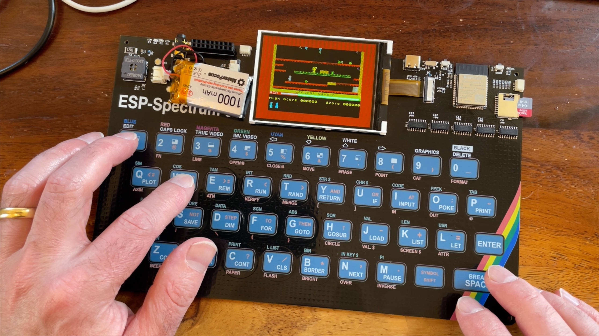

# ESP32 S3 ZX Spectrum - Hardware

This repository contains the hardware design files for the ESP32 S3 ZX Spectrum project.

You can follow the progress of this project using the newsletter [here](https://esp32zx.substack.com/). Please subscibe to get updates on the project.

## Schematic

View the PDF version of the schematic [here](images/esp32-s3-spectrum.pdf).

## What does it look like?

## See it in action

There are a bunch of videos showing the project in action on my the [atomic14 YouTube channel](https://www.youtube.com/atomic14).

Click on the image to jump to the [playlist](https://www.youtube.com/playlist?list=PL5vDt5AALlRf0H13krgzOf9XVX9lYcD5R).

